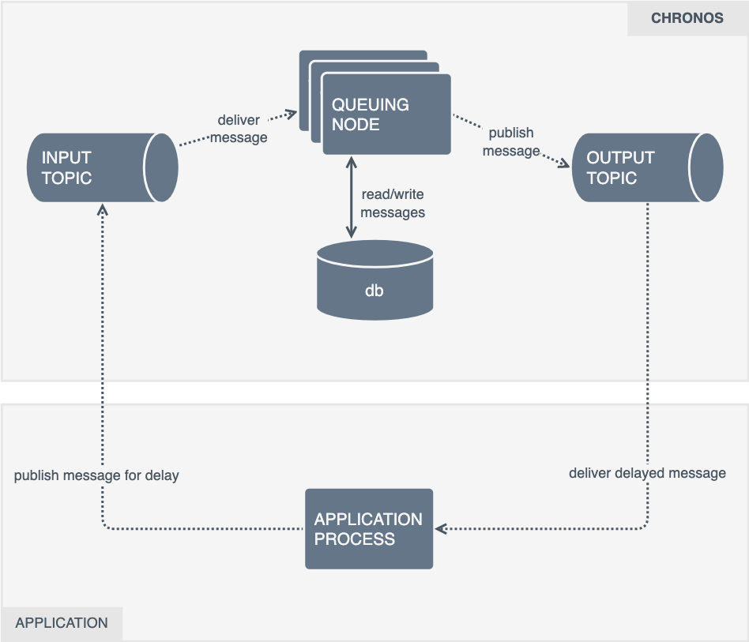
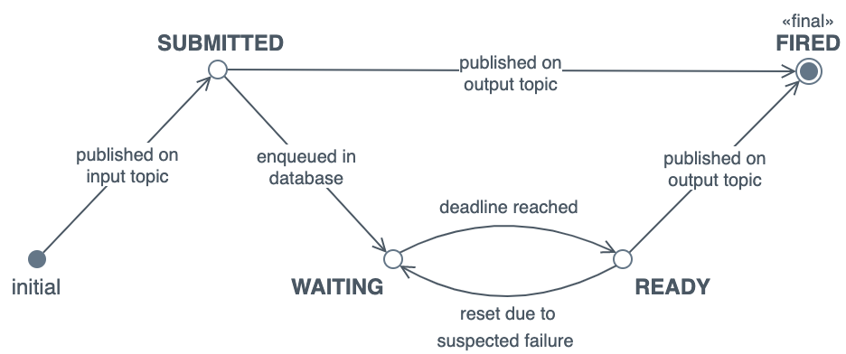

[](https://github.com/kindredgroup/chronos/actions/workflows/build.yml)
[](https://app.codecov.io/gh/kindredgroup/chronos)
# Chronos
Chronos (the personification of time in early Greek philosophy) is a persistent time-delay scheduler. It's generic enough to schedule any type of task with a user-specified time delay.

Chronos looks and feels just like an ordinary Kafka topic, albeit one that "magically" adds a delay to all messages.

<br/>

# Why do we need it?
A typical scenario: an event arrives on Kafka that requires some work to be done in the future — say, five seconds from now. We could just `Thread.sleep()`. This is generally not advisable because —

1. It assumes that the deadlines of successive events are monotonically nondecreasing. This isn't the case in practice. Events are received in partition-time order, and if a consumer blocks on some event, it could be late in processing the next event.
2. Kafka isn't suited to long-blocking behaviour and uses the regular polling of the broker by consumers as a liveness check. By sleeping, a consumer might be late in the next broker poll; Kafka will assume that the consumer is "stuck", and will unceremoniously reassign the partition to another consumer in the group. The next consumer will also block, and will again be purged from the group, forming a vicious cycle.

> **Note**
> 
> We quote Kafka as a stand-in for any event streaming platform. Alternatives, such as Kinesis, Pulsar, NATS Streaming, Redpanda, _et al._ have similar characteristics. They're essentially substitutes.

The idiomatic way of scheduling work from Kafka is to consume the event, place it _someplace else_, and move on to the next event. This "someplace" is a persistent task scheduler. Chronos is one such scheduler.

<br/>

# Rationale
The idea behind Chronos is to build the _simplest possible scheduler_ that is also —

1. **Persistent** — scheduled messages should not be lost.
2. **At-least-once capable** — once a message is scheduled, it is executed at least once. (This also implies #1.)
3. **Highly available** — there is always a scheduler around even when one fails.
4. **Has a Kafka-like interface.** (Because Kafka powers all asynchronous things here.) Ideally, it looks and feels just like an ordinary Kafka topic, albeit one that transparently adds a delay to all messages.
5. **Optimised for short-running tasks and high scheduling throughput.** (Thousands per second, at least.)
6. **Dependent only on existing infrastructure**, such as Postgres and Kafka.

Alternatively, we could use an off-the-shelf product, such as [Quartz](http://www.quartz-scheduler.org/) — a mature, richly featured scheduler. It's an "enterprise" bit of kit that takes some work to set up properly, with persistence, clustering, high availability and adequate performance. It needs to be "fed and watered", implying first-class DevOps, Infra and SRE support. In practice though, we'd only use a small subset of its capabilities. Quartz also requires a JVM interop or a message-oriented wrapper to work well with our use cases.

There are others like Quartz (mostly knock-offs). They are much of a muchness.

<br/>

# Design
## Concepts
**Application** — a process outside of Chronos that requires delay scheduling. It publishes a message on the _input topic_ and later consumes the delayed message on the _output topic_.

**Delay queue** — a logical queue of messages, wherein each message is subjected to some (specified) delay as it traverses the queue. The queue is not FIFO: a message may overtake another if (but not only if) their deadlines differ. A delay queue is purely conceptual; it is useful as a model of computation.

**Enqueuing** — writing a message to the database so that it can be fired later. This is done by the _queuing node_.

**Firing** — publishing a message on the output topic. This is also done by the _queuing node_.

**Hold time** — the longest time that a _queuing node_ may hold on to a _ready_ message before it is published on the output topic and deleted from the database. This interval acts as a liveness check for the node that readied the message. If that node fails to fire the message within the hold time (perhaps due to failure or processing delay), any other node is allowed to "take over" the message and fire it.

**Input topic** — where an application submits a message with the intention of delaying it.

**Message** — an encoded task/event/command/etc., requiring delayed scheduling.

**Output topic** — where an application receives a message after it has been suitably delayed.

**Queuing node** — a Chronos process responsible for reading from the input topic, writing to its internal database, reading from the database, and publishing to the output topic. Chronos comprises only one type of process that does several things, and all nodes act identically. (There is no concept of active/passive roles.) Chronos should be deployed with a minimum of two nodes for availability.

**Suspected failure** — when a queuing node is thought to have failed, based on a simple liveness check. In an asynchronous system, ideal failure detection is impossible: a suspected process may in fact be alive. All assertions made regarding process failure can, at best, be suspicions. 

**Task** — the description of an activity that needs to be performed at some point in time. A task is encoded as a Kafka message.

**Timing advance** — accounts for internal delays in the processing of messages and publishing to the output topic. The timing advance compensates for this internal delay by scheduling the messages just that bit earlier. In the simplest implementation, this value is determined experimentally and configured manually. More "adaptive" implementations may compute this value in real time.



## API
Chronos is entirely asynchronous and message-driven: publish a message on the _input_ topic... receive the (same) message sometime later on the _output_ topic. The names of these topics are configurable per environment, but are otherwise fixed. (I.e., the topics are defined up-front.)

Messages correspond to tasks at the application layer. Chronos treats messages opaquely; it does not care how tasks are encoded or executed. Applications are responsible for parsing and running tasks.

To use Chronos, applications must be provisioned with write permissions for the input topic, as well as read and commit-offset permissions for the output topic.

Headers:

```
chronosMessageId: 3767d5c7-aced-45e5-91f1-3f7ad8205a3f
chronosDeadline: 2022-12-01T11:09:01.123
```

Body: 

```json
{
  // a message that will be published later, using the same key as the original and containing the same value
}
```

## Idempotence
The `chronosMessageId` Kafka header uniquely identifies the message among the waiting and ready tasks. If a message with an existing ID is consumed from the input topic, it will be silently ignored.

After an existing message has been fired, it's "forgotten". This affects idempotence: if a message with the same ID appears on the input topic again, it will again be enqueued.

## Notional states
A Chronos message exists in one of several notional states. These translate to persistent representations of messages across the Kafka topic pair and the database.

* `submitted` — the message exists on the input topic only.
* `waiting` — the message is persisted in the database, but not yet ready to be fired.
* `ready` — the message is ready to be fired and exactly one node has taken the responsibility for firing it; i.e., the message is about to be published on the output topic.
* `fired` — the message has been fired; i.e., it now exists on the output topic.



As per the diagram above, a message can transition directly from `submitted` to `fired`. This occurs if a queuing node is late in consuming the message and decides to fire it immediately, bypassing the intermediate enqueuing and readying steps.

## Database schema
Chronos contains one table with the following attributes:

* `id`: `not null varchar(128)` — the globally unique (and free-form) ID of the message
* `deadline`: `not null timestamp` — when the message will become ready
* `readied_at` `timestamp` — set by the node that saw it first
* `readied_by` `uuid` of the node that readied the message
* `message_headers` `jsonb` in the form `[{"key1": "value1"}, {"key2": "value2"}, ..., {"keyN": "valueN"}]`
* `message_key`: `varchar(128)` — the key of the original message
* `message_value`: `blob` — the value of the original message

The `message_value` field will almost always be JSON in practice, but Chronos doesn't attempt to parse its contents — it simply forwards it on. The value may be quite large — beyond the `varchar` limit — hence the use of a `blob`.

## Assumptions
The clocks of all processes — consumers of Chronos, queuing nodes and the database server — are synchronised to within a few hundred milliseconds.

## Startup
Upon starting, each queuing node generates a random node ID (a UUID). The node ID is used for observability and failure detection, and is valid for the lifetime of the process. The process logs its ID on startup. If a process terminates and is later restarted, a new node ID will be generated. (I.e., they are treated as separate processes.)

## The Algorithm
There are (at least) three operations executing concurrently in the queuing node. These operations may be implemented as conventional threads.

1. **Consuming and enqueuing** — pulling messages from the input topic and storing them in the database, or publishing them directly if their deadline has lapsed.
2. **Readying and firing** — locating and reserving ready messages in the database, publishing them, and later deleting them from the database.
3. **Failure detection and recovery** — identifying peer nodes suspected of failure and resetting their readied messages.

### Consuming and enqueuing
All messages on the input topic are assumed to be Chronos-branded messages. They must, therefore, have the two header fields prescribed above. If a message lacks a required header or the header value is in the wrong format, that message is dropped and an error is logged.

A message requiring a delay is inserted into the database so that it can be published later. Before insertion, the queuing node compares the deadline to its local clock.

1. If the deadline has lapsed (i.e., it is within the 'timing advance' value), and the message does not already exist in the database, then it is published immediately on the output topic. (There's no point in enqueuing a message if it's already late.) The message is relayed as-is, along with any additional headers. The Chronos headers are not relayed.
2. Otherwise, a record is inserted into the database, subject to the uniqueness constraint on its ID. The original key, the value, and any additional (non-Chronos) headers are persisted with the message.

The Kafka offsets for the consumed message may be committed at this point, or any later point, having enqueued or published the message.

### Readying and firing
This is a two-phase operation.

In the first phase, queuing nodes periodically poll the database, updating records where —

* The `deadline` is older than 'current time' – 'timing advance'; and
* The `readied_at` timestamp is not set.

The update —

* Assigns the `readied_at` attribute to the current time.
* Assigns the `readied_by` attribute to the ID of the querying node.

The updated records are returned from the query. The queuing node then publishes the returned messages using the stored keys, values and headers. 

Messages may be published in parallel. There is no guarantee of relative order, even for same-key messages that have an identical delay.

In the second phase, the queuing node deletes the published records from the database. This may only occur after the publishing confirmations have been received from Kafka. 

When a node attempts to delete a record, it may observe that the record no longer exists. This is normal — in the event of a falsely suspected failure, a peer node will have taken over the message, published it, and then deleted it. A warning should be logged and no further action should be taken.

> **Note**
> 
> The `readied_by` attribute is used mostly for debugging purposes, indicating which node was suspected of failure.
> 
> In an asynchronous system, processing delays are indistinguishable from failures — a node may be falsely suspected of failure and some messages may be fired more than once. This is compatible with the at-least-once delivery guarantee.

The two-phase approach avoids multiple nodes from publishing the same message, provided that no failures are suspected.

By the completion of the second phase, the previously readied records should be purged. The steady-state size of the database of a free-flowing system is roughly a function of the submission rate and the message delays. E.g., if 1,000 messages are submitted per second and each message is delayed by three seconds, we expect there to be circa 3,000 records in the database, provided the system is operating within its throughput capacity. However, if demand exceeds capacity, we expect messages to queue inside the database and deadlines to be missed.

Upon finishing phase 2, the node waits for some time (configured as the 'poll interval', less the time taken to complete phase 2) and restarts phase 1. A small amount of randomness is added to the wait time so that queuing nodes that were deployed at the same time don't repeatedly query the database in unison.

### Failure detection and recovery
A queuing node may fail after commencing phase 1 and before completing phase 2 of the "readying and firing" operation. I.e., a message is successfully readied, but fails to fire. The failure detection and recovery operation identifies such messages and resets them to the waiting state. This is also done in two parts.

Firstly, suspected failures are identified. Each node periodically polls the database, identifying records where the `readied_at` timestamp is past its hold time. This yields a list of messages that appear to be stuck in the ready state.

Then, for each record, the node issues an update query to set `readied_at` and `readied_by` to `null` where those attributes are the _same_ as the outputs of the first query. If the record is updated successfully, a warning is logged — along the lines of `"suspected failure of {readied_by} for message {id}"`.

It may be that the second query does not update a record — if either the suspected node made progress or the record was reset by another node. Nothing is done in this case.

> **Note**
> 
> It's possible to accomplish the above with a single query; however, by splitting the queries, we not only reset stuck records but also determine and log the IDs of the failed nodes.

## Configuration
The following parameters should be configurable:

* Database connection settings.
* Kafka connection settings.
* Kafka input topic name.
* Kafka output topic name.
* Timing advance (default 50 ms, TBC) — specifies how many milliseconds _before_ the scheduling deadline should a message be fired.
* Hold time (default 5000 ms) — how many milliseconds to wait (lower bound) before forcibly taking over a ready message.
* Poll interval (default 100 ms) — how frequently the database should be polled for ready messages. A shorter interval leads to increased time resolution.
* Failure detection interval (default 500 ms) — how frequently to scan for messages stuck in the ready state.

<br/>

# Testing focus
This section discusses the aspects of Chronos that should be assured (apart from the usual unit+component testing).

## Queuing throughput
_How many messages we can process per unit of time._

There are two operations worth measuring. The "consuming and enqueuing" operation requires one DB transaction. The "readying and firing" operation requires two. One can assume that the latter will be somewhat slower. We can largely disregard the "failure detection and recovery" operation from a performance standpoint, as it runs less frequently and is mostly read-only. (Updates only occur when a failure is suspected.)

The longer the message delay, the more records we expect to accumulate in the database. Since indexed query performance slows (roughly) with the logarithm of table size, we can expect that both sets of queries slow down with increased message delays. Reasonable delays that we can expect are in the 3 to 10 second range. 

## Scheduling jitter
_The distribution of actual firing times relative to the requested times._

The jitter should be measured at varying workloads. We expect the jitter to be much smaller when few messages are being processed, relative to the jitter when the volume of messages approaches maximum capacity.

## Scalability
_The variability of the above metrics with the introduction of additional nodes._

Chronos is heavily I/O-bound, hence the database and (to a lesser extent) Kafka will limit throughput. Presumably, the number of nodes won't materially affect throughput, but this assumption should be verified.

## Availability
Refers to the continued ability to process messages in the presence of node failures. Also, the ability to eventually resume operation if either the database or Kafka temporarily "disappears".

<br/>

# SLAs
The following requirements are very approximate at this stage.

* The queuing throughput should be at least 1,000 messages/sec.
* The scheduling jitter should not exceed 500 ms for 99.9% of messages.

<br/>

# FAQ
### How can a delay queue be used to schedule long-running tasks?
Chronos operates at the message level, leaving task execution to the application. If a message corresponds to a long-running task, the application should delegate it to an appropriate task scheduler. An example of that is [chronos](https://github.com/kindredgroup/chronos). The process might be:

1. Encode the long-running task as a message.
2. Publish a message with a delay.
3. Receive the message later.
4. Create a chronos task after receiving the delayed message.

### Why can't failures be reliably detected in asynchronous systems?
Depending on your background, you might be used to the term "asynchronous" referring to some task that happens independently of another, often concurrently and in the background. You might even associate asynchrony with futures/promises, async/await keywords, coroutines, continuations, interrupts, callbacks, and so forth. These are all instruments for handling asynchronous computation.

Asynchrony here refers to _timing constraints_ as opposed to _programming models_. The word literally translates from Greek (ασύγχρονη) to "not with time". In a systems context, an _asynchronous task does not guarantee an upper bound on its execution time_. I.e., it doesn't "promise" to complete within some finite time, even if it is very likely to do so in practice. By comparison, a _synchronous task is guaranteed to complete within some finite time_.

Assume, momentarily, that it is possible to detect the failure of an asynchronous system by observing its output. This would require some upper bound on the execution time. The impossibility proof is by contradiction: asynchronous systems have no limit on the execution time, so no finite bound exists. In practical applications, completion timings fall into some known distribution. (It may be determined empirically.) If an execution fails to yield a result, we can deduce that the process has failed with some probability. We cannot, however, be certain. Synchronous systems provide an upper bound in the absence of failures. If this time is exceeded, we can categorically assert that the process has failed.

To learn more about failure detection and other useful concepts, consider reading [Distributed Computing Concepts: A Brief Introduction](https://medium.com/@ekoutanov/distributed-computing-concepts-f6275078a81).

### Why can't I have exactly-once delivery?
At-least-once semantics is a simple consequence of admitting failures. Interestingly, even if Chronos guaranteed that a message was published exactly once on the output topic, the application is still not certain to consume it exactly once. In a simple counterexample, an application may consume the message once, process it to some extent, then fail, restart, and consume the message a second time.

Exactly-once semantics are achieved through the combination of at-least-once delivery and idempotent handling on the consumer. I.e., the consumer must ensure that the duplicate processing of a message does not produce adverse side effects.# Chronos

## [ How to guide for Chronos ](./How-to.md)